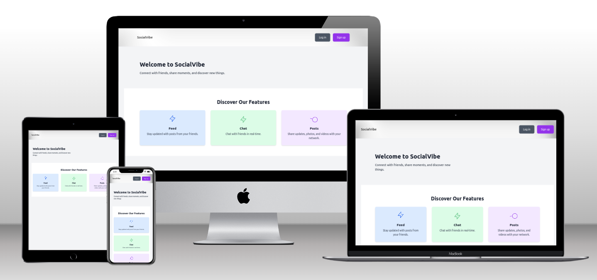
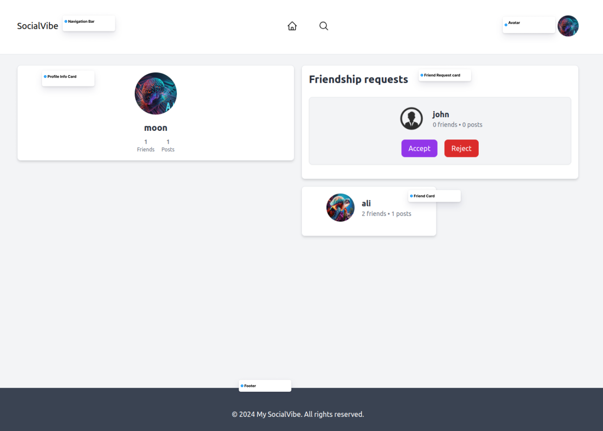
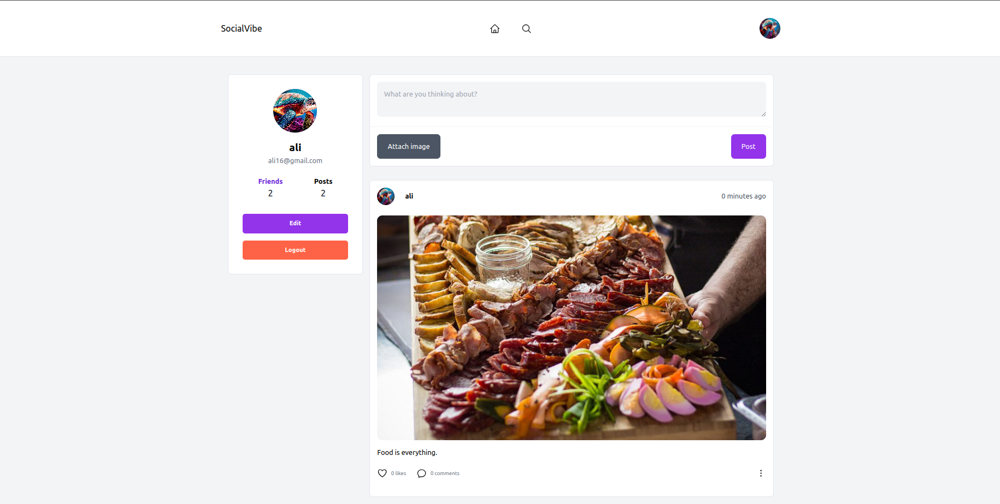

# SocialVibe

## Project Goal

The goal of SocialVibe is to create an innovative social media platform that fosters meaningful connections and engaging interactions among users. By integrating modern web technologies and user-centric design principles, SocialVibe aims to offer a seamless and enjoyable experience for sharing content, building communities, and staying connected with friends and family. This platform emphasizes user accessibility, and a feature-rich environment to cater to diverse social networking needs.
## Live Site

You can visit the live site here: [SocialVibe](https://socialvibe-reactapp-266cf4a0de7e.herokuapp.com/profile/727af7d4-596f-4416-b087-7576d76c60e0)

## Aim

The aim of SocialVibe is to:
- Provide a secure and user-friendly social media experience.
- Facilitate the creation and sharing of diverse content types.
- Enable users to build and engage with communities of interest.
- Offer advanced privacy settings to protect user data.
- Ensure accessibility for users with different needs and preferences.
- Continuously evolve based on user feedback and technological advancements.

Currently, SocialVibe allows users to:
- Register and create an account.
- View a personalized feed of content.
- Maintain and update their profile.
- Make and manage friendships.
- Search for users and content.

In the future, I plan to enhance the platform by adding:
- Chat and messaging options.
- Trending topics and content.
- Personalized people suggestions.

## User Goals

SocialVibe aims to help users achieve the following goals:
- **Stay Connected**: Easily connect with friends, family, and new acquaintances.
- **Share Content**: Post updates, photos, and other media to share life moments and thoughts.

- **Discover Content**: Find and explore content that aligns with personal interests and trends.

- **Engage Meaningfully**: Participate in meaningful conversations on other posts and interactions within their network.
- **Explore Friendships**: View friends' lists and visit friends' profiles to see their posts.

## User Experience

### Target Audience

- Individuals interested in social networking and content sharing.
- Users looking to connect with friends and discover new trends.
- Social media enthusiasts seeking an interactive platform for discussions and updates.

### Design Details

#### Colors and Fonts Used

**Font**: Utilizes a readable font for the interface with appropriate fallbacks for different platforms.

**Colors**:
- Text color: rgb(31,41,55,1) .
- Navbar background color: #fff.
- Button colors: rgb(147, 51, 234, 1),rgb(75, 85, 99, 1), rgba(255, 99, 71, 1).
- Main background color: rgb(243 244 246,1) .


## User Stories & Epics

All user stories were entered as issues in a GitHub Kanban project. Follow the link to see the project: [Project Link](https://github.com/users/zohaibshahzadkhan/projects/8)

### Epic 1: User Registration and Authentication
- [#1](https://github.com/zohaibshahzadkhan/SocialVibe-React-App/issues/12) - As a new user, I want to register an account so that I can access the platform.
- [#2](https://github.com/zohaibshahzadkhan/SocialVibe-React-App/issues/11) - As a user, I want to log in so that I can access my account and personalized features.

### Epic 2: User Profile Management
- [#3](https://github.com/zohaibshahzadkhan/SocialVibe-React-App/issues/3) - As a user, I want to create and update my profile so that I can share information about myself.
- [#4](https://github.com/zohaibshahzadkhan/SocialVibe-React-App/issues/10#issue-2380003138) - As a user, I want to view other users' profiles so that I can learn more about them.
- [#5](https://github.com/zohaibshahzadkhan/SocialVibe-React-App/issues/10#issue-2380003138) - As a user, I want to post updates so that I can share my thoughts and activities.
- 

### Epic 3: Social Networking Features
- [#6](https://github.com/zohaibshahzadkhan/SocialVibe-React-App/issues/14) - As a user, I want to see a feed of posts from my friends so that I can stay updated on their activities.
- [#7](https://github.com/zohaibshahzadkhan/SocialVibe-React-App/issues/9#issue-2379973541) - As a user, I want to search for other users so that I can find and connect with friends.
- [#8](https://github.com/zohaibshahzadkhan/SocialVibe-React-App/issues/8) - As a user, I want to add friends so that I can expand my social network.

### Epic 4: Content Interaction
- [#9](https://github.com/zohaibshahzadkhan/SocialVibe-React-App/issues/4) - As a user, I want to like posts so that I can show my appreciation for the content.
- [#10](https://github.com/zohaibshahzadkhan/SocialVibe-React-App/issues/1) - As a user, I want to comment on posts so that I can engage with the content and share my thoughts.

### Epic 5: Future Enhancements
- [#11](https://github.com/zohaibshahzadkhan/SocialVibe-React-App/issues/18) - As a user, I want to use a chat feature so that I can communicate directly with my friends (future development).
- [#12](https://github.com/zohaibshahzadkhan/SocialVibe-React-App/issues/17) - As a user, I want to see trending topics so that I can stay updated on popular content (future development).
- [#13](https://github.com/zohaibshahzadkhan/SocialVibe-React-App/issues/19) - As a user, I want to receive friend suggestions so that I can connect with more people (future development).

## Design
### ERD
<details>
  <summary>Entity Relationship Diagram</summary>
  
</details>


# Wireframes
<details>
  <summary>Home Page</summary>
  
</details>

<details>
  <summary>Login Page</summary>
  
</details>

<details>
  <summary>Signup Page</summary>
  
</details>

<details>
  <summary>Edit Profile Form</summary>
  
</details>

<details>
  <summary>Profile Page</summary>
  
</details>

<details>
  <summary>Search Page</summary>
  
</details>

<details>
  <summary>Friends Page</summary>
  
</details>


## Features

### User Registration
- **Feature**: Users can register by providing necessary details like username, email, and password.
- **Benefit**: Allows users to create a personalized account and access the platform's features.

<details>
  <summary>Signup Desktop</summary>
  
</details>

<details>
  <summary>Signup Mobile</summary>
  
</details>


### User Login
- **Feature**: Users can log in using their registered email and password.
- **Benefit**: Enables users to access their personalized content and maintain session security.
<details>
  <summary>Login Desktop</summary>
  
</details>

<details>
  <summary>Login Mobile</summary>
  
</details>

### Feeds
- **Feature**: Displays a personalized feed of posts from the user's friends and connections.
- **Benefit**: Keeps users updated with the latest activities and posts from their network.
<details>
  <summary>Feed Desktop</summary>
  
</details>

<details>
  <summary>Feed Mobile</summary>
  
</details>

### Profile Editing Form
- **Feature**: Users can edit their profile information, including profile picture, name, and personal email.
- **Benefit**: Allows users to keep their profile information current and reflective of their identity.
  
<details>
  <summary>Edit Profile Form Desktop</summary>
  
</details>

<details>
  <summary>Edit Profile Form Mobile</summary>
  
</details>


### Profile Page
- **Feature**: Displays user's profile with friends count, post count, and options to add posts (text or image), read posts, and delete posts.
- **Benefit**: Provides a comprehensive view of the user's activity and allows content management.

<details>
  <summary>Profile Page Desktop</summary>
  
</details>

<details>
  <summary>Profile Page Mobile</summary>
  
</details>


### Friend Management
- **Feature**: Users can see incoming friend requests, accept or reject them, and view a list of their friends.
- **Benefit**: Facilitates building and managing a social network.
<details>
  <summary>Friends Page Desktop</summary>
  
</details>

<details>
  <summary>Friends Page Mobile</summary>
  
</details>

### Comment and Like Posts
- **Feature**: Users can like and comment on posts to engage with the content.
- **Benefit**: Encourages interaction and engagement on the platform.
  
<details>
  <summary>Comment and Like Post Desktop</summary>
  
</details>

<details>
  <summary>Comment and Like Post Mobile</summary>
  
</details>

### Search Functionality
- **Feature**: Users can search for other users and posts using a dedicated search page.
- **Benefit**: Makes it easy to find specific content and connect with new users.

<details>
  <summary>Search Page Desktop</summary>
  
</details>

<details>
  <summary>Search Page Mobile</summary>
  
</details>


### Future Features

#### Trends
- **Feature**: Display trending topics and content based on user engagement and activity.
- **Benefit**: Keeps users informed about popular discussions and trending content on the platform.

#### Chat
- **Feature**: Real-time chat functionality for direct messaging between users.
- **Benefit**: Enhances communication by allowing private and instant conversations.

#### People You May Know
- **Feature**: Suggests potential friends based on mutual connections and shared interests.
- **Benefit**: Helps users expand their social network by connecting with people who have common interests or mutual friends.

### FlowChart 
<details>
  <summary>SocialVibe Flow Chart</summary>
  
  <p>Generated by <a href="https://www.lucidchart.com/">Lucidchart</a></p>
</details>

### Description

1. **Home Page**: The starting point of the app.
2. **Login Page**: Users can log in here.
3. **Signup Page**: New users can create an account.
4. **Profile Page**: Users can view and manage their profile.
5. **Edit Profile Page**: Users can edit their profile details.
6. **Search Page**: Users can search for friends and other content.
7. **Friends Page**: Users can view their friends list.
8. **Feed Page**: Users can view the latest updates and posts from their friends and connections.

## Project Structure

This project utilizes Vite for fast development and React for building user interfaces.


### React

React is a declarative, efficient, and flexible JavaScript library for building user interfaces. It allows for the creation of reusable components which manage their own state, making it easier to develop and maintain complex UIs.

#### Reasons for using React:

- **Speed**: Enhances page loading speed and overall user experience.
- **Flexibility**: Easier to maintain and more adaptable due to its modular structure.
- **React Bootstrap**: Provides pre-built components for improved styling and responsiveness.
- **Reusability**: Facilitates the creation and reuse of components across the application.

### Components

- `<FeedForm />`: Manages the input form for creating new feed items.
- `<FeedItem />`: Displays individual feed items.
- `<Footer />`: Provides the footer section of the application.
- `<NavBar />`: Contains navigation links and user profile actions.
- `<ProfileInfo />`: Displays user profile information.
- `<Toast />`: Handles toast notifications for user feedback.

### Pages

- **Home**: The main landing page of the application.
- **Edit Profile**: Allows users to update their profile information.
- **Feed**: Displays a list of feed items.
- **Friends**: Manages user's friend list and friend requests.
- **Login**: User login page.
- **Signup**: User registration page.
- **Post**: Handles creating and viewing individual posts.
- **Profile**: Displays the user's profile page.
- **Search**: Provides search functionality for users and posts.

### Contexts

- **ToastContext**: Manages toast notifications.
- **UserContext**: Handles user authentication and profile information.
- **SearchContext**: Manages the search functionality.
- **PostsContext**: Manages posts, including creating, editing, and deleting posts.
- **FriendshipContext**: Manages friendships and friend requests.

### Providers

All contexts are wrapped in the `AppProviders` component to provide global state management.


## Bug

### Issue Description

When a user manually types the URL of a feed item in the browser without being authenticated, the feed item is visible, but the user cannot make requests due to the lack of authentication token.


<details>
  <summary>FeedItem bug</summary>
  
</details>

### Proposed Solution

To address this issue, we can conditionally render the feed form based on the user's authentication status. The `isAuthenticated` flag is already available in the `UserContext`, which manages user authentication state throughout the application.

#### Implementation Steps

1. **Context Integration**: Ensure `isAuthenticated` is properly managed in `UserContext` and accessible throughout the application.

2. **Conditional Rendering**: Modify the rendering logic for the feed form component (`<FeedForm />`) to check the `isAuthenticated` flag before displaying the form.

   Solution:
   ```jsx
   import { useContext } from 'react';
   import { UserContext } from './UserContext';

   const FeedForm = () => {
     const { isAuthenticated } = useContext(UserContext);

     return isAuthenticated ? (
       <div>
         {/* Render feed form content */}
       </div>
     ) : (
       <></> // Render nothing or a placeholder if user is not authenticated
     );
   };

   export default FeedForm;

