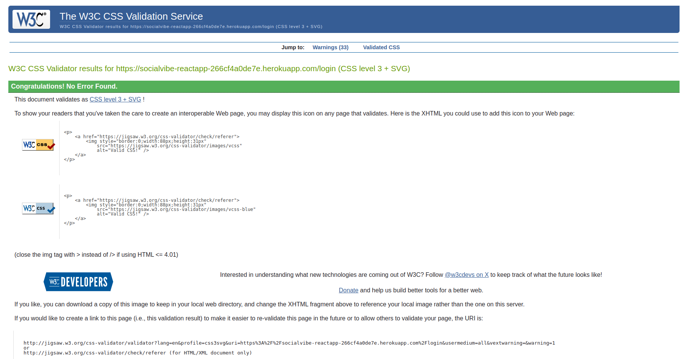

# SocialVibes

[<< Back to ReadMe](./README.md)

## Automated Tests

I have 4 test suits with 9 tests for my code.

## Manual Testing

### Feature 1: User Authentication

| Test | Description | Expected Outcome | Result |
|------|-------------|------------------|--------|
| 1    | Sign Up     | Create a new user account with valid details. | User account is successfully created and can log in. |
| 2    | Sign In     | Log in with valid credentials. | User is authenticated and redirected to the dashboard. |
| 3    | Form Validation - Sign Up | Submit sign up form with invalid data (e.g., invalid email format, password too short). | Form displays appropriate error messages. |
| 4    | Form Validation - Sign In | Submit sign in form with invalid credentials. | Form displays error message indicating invalid credentials. |
| 5    | Log Out     | Log out from the user account. | User is logged out and redirected to the home screen. |

### Feature 2: Profile Management

| Test | Description | Expected Outcome | Result |
|------|-------------|------------------|--------|
| 1    | View Profile | Navigate to the profile page. | User profile information is displayed correctly. |
| 2    | Edit Profile | Update profile details (name, email, image) with valid information. | Profile details are updated successfully, and success message is displayed. |
| 3    | Upload Profile Image | Change profile picture using the image upload form. | New profile picture is displayed after upload. |
| 4    | Form Validation - Edit Profile | Submit edit profile form with invalid data. | Form displays appropriate error messages. |

### Feature 3: Post Management

| Test | Description | Expected Outcome | Result |
|------|-------------|------------------|--------|
| 1    | Create Post with Text | Write a new post with text content only. | Post is successfully created and visible in the feed and Profile Page. |
| 2    | Create Post with Image | Write a new post with an attached image. | Post with image is successfully created and visible in the feed. |
| 3    | Delete Post | Delete a post from the user's profile. | Post is removed from the feed and no longer visible. |
| 4    | Like Post | Like a post from another user. | Like count increases and user is notified. |
| 5    | Comment on Post | Add a comment to a post. | Comment is successfully added and visible under the post. |

### Feature 4: Friend Management

| Test | Description | Expected Outcome | Result |
|------|-------------|------------------|--------|
| 1    | View Friends List | Navigate to the friends page. | List of friends is displayed with their profiles. |
| 2    | Send Friend Request | Send a friend request to another user. | Friend request is sent, and recipient can see request on friends page. |
| 3    | Accept Friend Request | Accept a pending friend request. | User becomes friends with the requester. |
| 4    | Reject Friend Request | Reject a pending friend request. | Friend request is rejected. |

### Feature 5: User Profile Interaction

| Test | Description | Expected Outcome | Result |
|------|-------------|------------------|--------|
| 1    | Visit Another User's Profile | Click on a user's avatar or name to view their profile. | User profile information is displayed with an option to send a friend request if not already friends. |

### Feature 6: Search Functionality

| Test | Description | Expected Outcome | Result |
|------|-------------|------------------|--------|
| 1    | Search Users | Enter a query to search for users by name or username. | List of users matching the search query is displayed. |
| 2    | Search Posts | Enter a query to search for posts containing specific keywords. | List of posts matching the search query is displayed. |

## User Stories Testing

### User Story 1: Comment on a Post

#### Test Cases

##### Comment Button Display
- **Description**: Check if the "Comment" button/icon is visible next to each post.
- **Expected Outcome**: The "Comment" button/icon is displayed next to each post. (Pass)

##### Open Comment Input
- **Description**: Click the "Comment" button/icon to open a text input area.
- **Expected Outcome**: The text input area for writing a comment opens up. (Pass)

##### Submit Comment
- **Description**: Write a comment and click the "Post Comment" button.
- **Expected Outcome**: The new comment is displayed under the post without reloading the page. (Pass)

### User Story 2: Log Out

#### Test Cases

##### Logout Button Display
- **Description**: Check if the "Logout" button is visible in the user profile section.
- **Expected Outcome**: The "Logout" button is displayed in the user profile section. (Pass)

##### Trigger Logout
- **Description**: Click the "Logout" button.
- **Expected Outcome**: The user's authentication tokens are removed from local storage, and the user is redirected to the home page. (Pass)

### User Story 3: Like a Post

#### Test Cases

##### Like Button Display
- **Description**: Check if the "Like" button/icon is visible next to each post.
- **Expected Outcome**: The "Like" button/icon is displayed next to each post. (Pass)

##### Like Post
- **Description**: Click the "Like" button/icon.
- **Expected Outcome**: The like count increases, and the button/icon changes to indicate that the post is liked without reloading the page. (Pass)

##### Success/Error Message
- **Description**: Ensure appropriate messages are displayed after liking a post.
- **Expected Outcome**: Success message on like, error message if the action fails. (Pass)

### User Story 4: Update Comments on a Post

#### Test Cases

##### Display Comments
- **Description**: Check if all comments on posts are displayed.
- **Expected Outcome**: All comments on the posts are displayed. (Pass)

##### Add Comment
- **Description**: Add a new comment to a post.
- **Expected Outcome**: The comment is successfully added and displayed under the post. (Pass)

### User Story 5: View Feed

#### Test Cases

##### Display All Posts
- **Description**: Navigate to the feed page.
- **Expected Outcome**: All posts are displayed, with the most recent posts first. (Pass)

### User Story 6: Log In

#### Test Cases

##### Display Login Form
- **Description**: Check the presence of email and password fields and the submit button on the login page.
- **Expected Outcome**: The login form with email, password, and submit button is displayed. (Pass)

##### Form Validation
- **Description**: Submit the login form with invalid data.
- **Expected Outcome**: Appropriate error messages are displayed. (Pass)

##### Successful Login
- **Description**: Log in with valid credentials.
- **Expected Outcome**: User is authenticated, tokens are stored, and the user is redirected to Feed page. (Pass)

##### Error Handling
- **Description**: Log in with incorrect credentials.
- **Expected Outcome**: Error messages are displayed indicating incorrect credentials. (Pass)

### User Story 7: View and Interact with Feed Page

#### Test Cases

##### Feed Page Layout
- **Description**: Check the structure of the feed page.
- **Expected Outcome**: The page has a post creation form at the top and a list of posts below. (Pass)

##### Create New Post
- **Description**: Create a new post with text and/or images.
- **Expected Outcome**: The post is successfully created and displayed in the feed. (Pass)

##### Post Interactions
- **Description**: Like and comment on posts from the feed.
- **Expected Outcome**: Interactions update without reloading the page. (Pass)

##### Delete Post
- **Description**: Delete a post from the feed.
- **Expected Outcome**: The post is removed from the feed and a success message is displayed. (Pass)

### User Story 8: Send and Receive Friend Requests

#### Test Cases

##### Send Friend Request
- **Description**: Send a friend request from another user's profile.
- **Expected Outcome**: The friend request is sent, a success message is displayed, and the request button is hidden. (Pass)

##### View Friend Requests
- **Description**: View incoming friend requests on the "Friends" page.
- **Expected Outcome**: Incoming requests are displayed with options to accept or reject. (Pass)

##### Accept/Reject Friend Request
- **Description**: Accept or reject a pending friend request.
- **Expected Outcome**: Friend is added or request is removed with a success message. (Pass)

### User Story 9: Delete Posts

#### Test Cases

##### Delete Button Display
- **Description**: Check if the "Delete" icon is visible next to the user's own posts.
- **Expected Outcome**: The "Delete" icon is displayed next to the user's posts. (Pass)

##### Delete Post
- **Description**: Click the "Delete" icon.
- **Expected Outcome**: The post is removed from the feed and a success message is displayed. (Pass)

### User Story 10: Update Profile Information

#### Test Cases

##### Edit Profile Navigation
- **Description**: Navigate to the "Edit Profile" page.
- **Expected Outcome**: The user is redirected to the "Edit Profile" page. (Pass)

##### Update Profile Details
- **Description**: Update name, email, and profile image.
- **Expected Outcome**: Profile details are updated, and a success message is displayed without reloading the page. (Pass)

##### Form Validation
- **Description**: Submit the edit profile form with invalid data.
- **Expected Outcome**: Appropriate error messages are displayed. (Pass)

### User Story 11: Search Functionality

#### Test Cases

##### Search Input
- **Description**: Enter a search query in the search input field.
- **Expected Outcome**: Relevant search results for posts and users are displayed. (Pass)

##### Handle Empty/Invalid Queries
- **Description**: Submit an empty or invalid search query.
- **Expected Outcome**: An appropriate message or notification is displayed. (Pass)

### User Story 12: Navigation Bar

#### Test Cases

##### Navigation Bar Display
- **Description**: Check the visibility and structure of the navigation bar on all pages.
- **Expected Outcome**: The navigation bar is displayed with links to Feed, Search, Login, Signup, and user profile. (Pass)

##### Conditional Rendering
- **Description**: Ensure navigation links are displayed based on authentication status.
- **Expected Outcome**: Authenticated users see Feed, Search, and Profile; unauthenticated users see Login and Signup. (Pass)

##### Navigation Links
- **Description**: Click navigation links to navigate through the app.
- **Expected Outcome**: The user is redirected to the respective pages. (Pass)

### User Story 13: Sign Up

#### Test Cases

##### Display Signup Form
- **Description**: Check the presence of email, name, password, confirm password fields, and the submit button on the signup page.
- **Expected Outcome**: The signup form with all fields and submit button is displayed. (Pass)

##### Form Validation
- **Description**: Submit the signup form with invalid data.
- **Expected Outcome**: Appropriate error messages are displayed. (Pass)

##### Successful Signup
- **Description**: Create a new account with valid data.
- **Expected Outcome**: Account is successfully created, and the user is redirected to the login page with a success message. (Pass)

### User Story 14: View Friends and Handle Requests

#### Test Cases

##### Friends Page Layout
- **Description**: Check the layout of the Friends page.
- **Expected Outcome**: The page is divided into sections for user info, friends list, and pending requests. (Pass)

##### View Pending Requests
- **Description**: View incoming friend requests.
- **Expected Outcome**: Pending friend requests are displayed with accept and reject options. (Pass)

##### Accept/Reject Requests
- **Description**: Accept or reject a friend request.
- **Expected Outcome**: Friend request is accepted or rejected, the list updates, and a success message is shown. (Pass)

##### View Friends List
- **Description**: View the list of friends.
- **Expected Outcome**: Friends are displayed in a card format with avatars, names, friends count, and posts count. (Pass)

### User Story 15: Profile Page

#### Test Cases

##### Profile Information Card
- **Description**: Check the display of the user’s profile information.
- **Expected Outcome**: User’s avatar, email, friends count, and posts count are displayed correctly. (Pass)

##### Create New Post
- **Description**: Create a new post with text and/or image from the profile page.
- **Expected Outcome**: The new post is successfully created and displayed in the post list. (Pass)

##### Interact with Posts
- **Description**: Like and comment on posts from the profile page.
- **Expected Outcome**: Like and comment actions update the post without reloading the page. (Pass)

##### Delete Post
- **Description**: Delete a post from the profile page.
- **Expected Outcome**: The post is removed, and a success message is displayed. (Pass)

## Lighthouse/ Accessibility Testing
With the Lighthouse tests, there are some best practices issues due to Cloudinary using HTTP protocol, which affects HTTPS/HTTP request best-practice scores negatively.

Home Page

Friends Page

Profile Page

Login Page

Signup Page

Search Page

## Devices used for manual testing
SocialVibe was tested using Chrome desktop and mobile browsers

## Code Validation
### Jsx Linter and Formatter
No Errors were found

Linter and Formatter Text

### HTML
No Errors were found

Home Page

Friends Page

Profile Page

Login Page

Signup Page

Search Page

Edit Profile Page

### CSS
No Errors were found

Home Page

Friends Page

Profile Page

Login Page

Signup Page

Search Page

Edit Profile Page

[<< Back to ReadMe](./README.md)